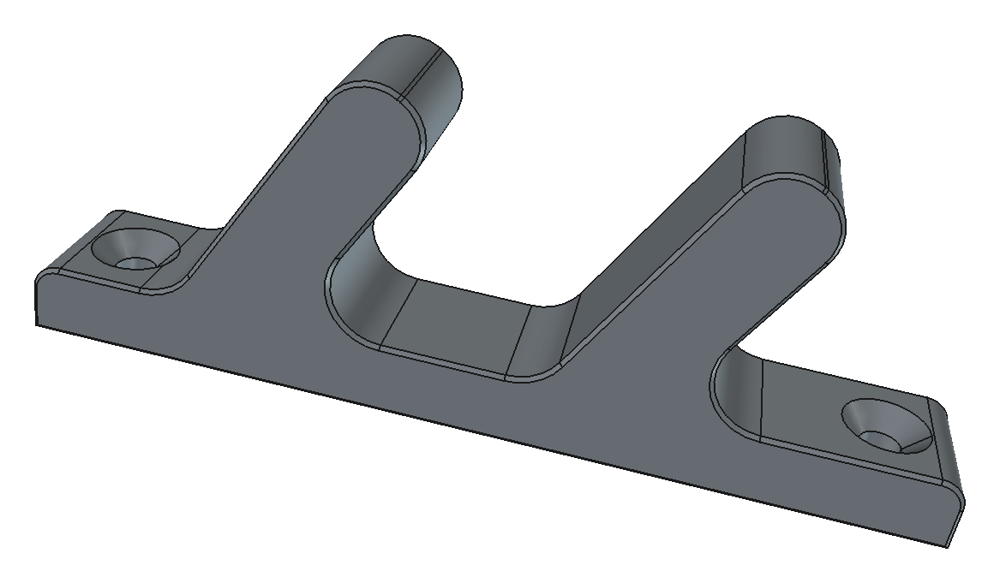

# AgentSmith — AI modeling agent for FreeCAD

AgentSmith turns FreeCAD into an AI-driven parametric modeling workstation. You
type (or dictate) what you want; an AI backend edits the **live document**
through a supervised local bridge, an engineering-knowledge harness keeps it
honest about materials and manufacturability, an independent reviewer checks the
result, and a real slicer says whether it will print. When it will, the G-code
goes straight to your printer.

<p align="center">
  
  <br>
  <em>Modeled from one sentence: a double wall hook — countersunk screw holes,
  filleted hooks, laid out to print flat without supports.</em>
</p>

```
you ──prompt/voice──▶ chat panel ──▶ AI backend CLI ──▶ bridge (localhost socket)
                          │                                    │
                          │                              live FreeCAD document
                          ▼                                    │
                   supervisor: checkpoint, watchdog, rollback ──┘
                          │
                          └─▶ OrcaSlicer ─▶ pre-flight ─▶ printer (PrusaLink / Moonraker)
```

---

## What it does

- **Models from a prompt or a reference image.** Photos are attached as vision
  input; the harness forces interpretation before geometry — which view is this,
  what is the functional pose, which feature does the work.
- **Knows engineering, not just CAD.** Playbooks for FDM materials and
  anisotropy, mechanics sizing, design-for-minimal-supports, tolerances,
  fasteners, gears and workbenches, enclosures, sheet metal, design & ergonomics
  (edge treatment, grip dimensions, stability), plus a pattern library
  (snap-fits, threaded bosses, hinges…). Twenty-one playbooks, indexed and
  loaded by trigger, plus two files that always go along: the core methodology
  and the accumulated lessons.
- **Treats the brief as a contract.** Every requirement in your prompt becomes a
  numbered checklist item that is verified — or reported as an explicit
  deviation — before the task ends. Unknowns are looked up (reference dimension
  tables, your attached images, web search where the backend has one) or stated
  as open questions with the assumption that was made; every number carries its
  provenance. A pre-mortem pass asks how each functional feature will fail in
  service before declaring the model done.
- **Verifies instead of asserting.** Geometry probes (`model_digest`,
  `cross_section`, `print_readiness`, `feature_probe` for hole axes and mounting
  faces), an independent read-only reviewer with optional auto-fix rounds, and an
  eval harness that grades models against golden tasks.
- **Slices and prints from chat.** "naslicuj to" / "vytiskni to" runs real
  OrcaSlicer, reports supports and warnings, and uploads to the printer.
- **Refuses to print blind.** Before starting a print it compares the nozzle
  diameter and filament baked into the G-code against what the machine actually
  reports, and blocks the start on a mismatch.
- **Protects your document.** Every task runs against a checkpointed document
  with a watchdog, mutation guards and automatic rollback on failure.
- **Finds and monitors your printers.** mDNS discovery, a remembered printer list
  independent of which network you are on, and a 30-second background monitor so
  the panel always knows what is usable.
- **Takes dictation.** Optional local speech-to-text; the audio never leaves your
  machine and the transcript is never sent without you pressing send.

---

## Requirements

Only the first two are needed to model. Everything else buys a capability, and
the addon degrades cleanly without it — a missing piece produces an explanation,
not a traceback.

### Required

| Dependency | Version | Why | Install |
|---|---|---|---|
| **FreeCAD** | 1.0+ (developed on 1.1.1) | The host application; supplies Python and Qt | AppImage from [freecad.org](https://www.freecad.org/downloads.php), or your distribution's package |
| **An AI backend CLI** | any one of three | Runs the actual modeling agent | `claude` ([Claude Code](https://claude.com/claude-code)), `codex` (OpenAI Codex CLI), or `copilot` (GitHub Copilot CLI) — on `PATH` and already authenticated |

**No Python packages are required.** The addon is stdlib-only on purpose:
FreeCAD ships its own interpreter and users generally cannot `pip install` into
it. Everything else is an external program invoked as a subprocess.

### Optional — slicing and printing

| Dependency | Why | Notes |
|---|---|---|
| **OrcaSlicer** 2.4+ | Real slicing feedback and G-code | AppImage or system install. Searched for in `~/AppImages`, `~/Applications`, `~/.local/bin`, `~/Downloads`, `/opt`, `/usr/local/bin`; override with `orca_appimage` in `slicer-config.json` |
| **A network printer** | Uploading and starting prints | **PrusaLink** (Prusa MK4 / CORE One / XL) or **Moonraker** (Klipper: QIDI, Voron, …). Nothing to install — just the printer on your network |

### Optional — voice input

| Dependency | Why | Install |
|---|---|---|
| **whisper.cpp** (`whisper-cli`) | Local speech-to-text | Build from [ggml-org/whisper.cpp](https://github.com/ggml-org/whisper.cpp) — see below |
| **A Whisper model** | The actual recognition | `large-v3-turbo-q5_0` (547 MB) recommended, `medium-q5_0` (514 MB) is faster. The panel can download it for you |
| **A VAD model** | Stops whisper inventing sentences out of silence | `ggml-silero-v5.1.2.bin`, 885 kB |
| **A recorder** | Capturing the microphone | One of `pw-record` (PipeWire), `arecord` (`alsa-utils`), `ffmpeg`, `sox`. Most Linux desktops already have one |
| **Vulkan** | GPU acceleration for whisper | `libvulkan-dev` + `glslc`. Measured on an AMD Radeon 780M: **26 s → 3.4 s** per dictation |

> **Czech (and other non-English) users:** the small Whisper models transcribe
> Czech badly enough to look broken. `medium` is the practical floor; the panel
> deliberately does not offer `tiny` or `base`.

### Optional — MCP

The bridge can be exposed to the backend as typed MCP tools instead of a CLI
wrapper (`mcp_server.py`). No extra dependency — the backend must simply support
MCP. Off by default; toggle it in the panel.

---

## Install

### 1. The addon

```bash
git clone <this repo> && cd 3dTest
./install.sh          # symlinks freecad_bridge/ into FreeCAD's Mod directory
```

`install.sh` finds the right `Mod` directory for your FreeCAD version
(`~/.local/share/FreeCAD/v1-1/Mod` on 1.1, older layouts too) and links rather
than copies, so pulling this repo updates the addon.

Restart FreeCAD → select the **AgentSmith** workbench → **Start bridge**.

> Changing addon code needs a FreeCAD restart (or **Reload updated bridge**).
> Python modules already imported stay in memory, and a panel running yesterday's
> code is a genuinely confusing thing to debug.

### 2. A backend

Install and authenticate one CLI, then pick it in the panel's **Backend** menu:

```bash
claude --version        # Claude Code
codex --version         # OpenAI Codex CLI
copilot --version       # GitHub Copilot CLI
```

### 3. Slicing (optional)

Put an OrcaSlicer AppImage in one of the searched directories, then describe your
printers in `freecad_bridge/slicer-config.json`:

```jsonc
{
  "default_printer": "core_one",
  "orca_appimage": "",                    // empty = search the usual places
  "printers": {
    "core_one": {
      "label": "Prusa CORE One (0.4 nozzle, PLA loaded)",
      "machine": "Prusa CORE One 0.4 nozzle",
      "process": "0.20mm SPEED @CORE One 0.4",
      "filaments": {                             // material is a property of the
        "pla":  "Prusa Generic PLA @CORE One",   // spool, not of the machine
        "petg": "Prusa Generic PETG @CORE One"
      },
      "loaded_filament": "pla",           // what is actually in the machine now
      "network": {
        "type": "prusalink",              // or "moonraker"
        "host": "192.168.0.170",
        "api_key_file": "~/.config/agentsmith/prusalink-core_one.key"
      }
    }
  }
}
```

Check it:

```bash
cd freecad_bridge
python3 slice_check.py --list-printers
python3 print_send.py --status
```

**Credentials never go in this file** — it is tracked in git. Put the PrusaLink
password (Settings → Network → PrusaLink; it doubles as the API key) in the file
named by `api_key_file`:

```bash
mkdir -p ~/.config/agentsmith
printf '%s' 'YOUR-PRUSALINK-PASSWORD' > ~/.config/agentsmith/prusalink-core_one.key
chmod 600 ~/.config/agentsmith/prusalink-core_one.key
```

You usually do not need to fill in `host` by hand — the panel's printer list
discovers machines on the network and can write the entry for you.

### 4. Voice (optional)

```bash
# whisper.cpp — no sudo, all inside your home directory
git clone --depth 1 https://github.com/ggml-org/whisper.cpp \
    ~/.local/share/agentsmith/whisper.cpp
cd ~/.local/share/agentsmith/whisper.cpp
cmake -B build -DCMAKE_BUILD_TYPE=Release && cmake --build build -j
ln -s "$PWD/build/bin/whisper-cli" ~/.local/bin/whisper-cli

# models (or just press "Diktovat" in the panel and let it download one)
mkdir -p ~/.local/share/agentsmith/whisper && cd $_
curl -LO https://huggingface.co/ggerganov/whisper.cpp/resolve/main/ggml-large-v3-turbo-q5_0.bin
curl -LO https://huggingface.co/ggml-org/whisper-vad/resolve/main/ggml-silero-v5.1.2.bin
```

<details>
<summary><b>GPU acceleration (optional, but it is a 10× difference)</b></summary>

The encoder dominates transcription time and runs far better on a GPU. Measured
on an AMD Radeon 780M: encoder 24.5 s → 2.36 s, total 26 s → 3.4 s, with a
byte-identical transcript.

```bash
sudo apt install libvulkan-dev glslc          # the only step needing root

# SPIRV-Headers are header-only and can live in your home directory
git clone --depth 1 https://github.com/KhronosGroup/SPIRV-Headers \
    ~/.local/share/agentsmith/deps/src/SPIRV-Headers
cmake -S ~/.local/share/agentsmith/deps/src/SPIRV-Headers -B /tmp/spirv-build \
      -DCMAKE_INSTALL_PREFIX=~/.local/share/agentsmith/deps
cmake --install /tmp/spirv-build

cd ~/.local/share/agentsmith/whisper.cpp
DEPS=~/.local/share/agentsmith/deps
cmake -B build-vulkan -DCMAKE_BUILD_TYPE=Release -DGGML_VULKAN=ON \
      -DCMAKE_PREFIX_PATH=$DEPS -DCMAKE_CXX_FLAGS="-I$DEPS/include"
cmake --build build-vulkan -j
ln -sf "$PWD/build-vulkan/bin/whisper-cli" ~/.local/bin/whisper-cli
```
</details>

Environment overrides, if your layout differs: `AGENTSMITH_WHISPER_BIN`,
`AGENTSMITH_WHISPER_MODEL`, `AGENTSMITH_RECORDER`.

---

## Using it

### Modeling

1. Open or create an `.FCStd` document — the panel works on the **live** one.
2. Press **Start bridge**.
3. Describe the part. Be specific about what it must *do*; the harness turns
   function into geometry, but it cannot guess the function.
4. Optionally add reference images (paths or URLs, one per line) in **Reference**.
5. **Odeslat**.

While it runs you get a live log, a supervisor status line and a progress
readout. On failure the document is rolled back to the checkpoint taken before
the task started.

Panel controls worth knowing:

| Control | What it does |
|---|---|
| **Rozpočet** | Wall-clock budget; the watchdog stops a task that overruns |
| **Reviewer** | An independent read-only pass that grades the result afterwards |
| **Auto-oprava** | Lets the agent fix what the reviewer found, up to N rounds |
| **Bez eskalace** | Optionally retry a failed round on a stronger model |
| **MCP** | Expose the bridge as typed MCP tools instead of the CLI wrapper |
| **Snímky** | Which views are captured as visual context |
| **Zapsat lekci** | Turn a failure into a permanent harness lesson |

### Voice

Press **🎤 Diktovat**, speak, press **⏹ Zastavit**. The transcript is appended to
the prompt box — **it is never sent automatically**. A misheard dimension would
otherwise start an autonomous run against your live document.

Nothing is uploaded: recording, transcription and the recording's deletion all
happen locally.

### Printers

The **Tiskárny** panel lists your printers the moment it opens (from the
remembered list on disk) and keeps their state current in the background, every
30 seconds.

| Column | Meaning |
|---|---|
| Stav — *nalezena* | Something answered, but we do not know what it is |
| Stav — *odpovídá (chybí klíč)* | A printer is there and we cannot authenticate |
| Stav — *připojeno* | The credential works; we can read the machine |
| Stav — *nedostupná* | Remembered, not reachable from here right now |
| Umím slicovat | Whether a slicer profile exists — **a separate question** |

Those last two columns are deliberately independent. A printer can be online and
still unusable because no profile is configured for it, and saying so is more
useful than one green lamp that means neither.

- **Hledat** — passive mDNS discovery. One multicast question; nothing is aimed at
  individual hosts.
- **i aktivní sken sítě** — opt-in. This is a port scan of your local /24:
  unremarkable at home, and something that trips intrusion detection on a managed
  network. Off by default, and the tooltip says so.
- **Right-click** — rename, forget, or write a discovered machine into the slicer
  config.
- **Přidat podle IP…** — for networks where discovery cannot work. A switched-off
  printer can be added too; it simply stays unreachable until it answers.

Printers are remembered by **identity, not address** — the machine's hostname and
what it reports about itself — so a DHCP change does not create a duplicate and
moving your laptop to another network does not empty the list. If something else
answers at a remembered address, the row says so instead of presenting a
stranger's device as your printer.

### Slicing and printing

Ask in chat ("naslicuj to", "vytiskni to na Prusovi z PLA"), or run the tools:

```bash
cd freecad_bridge
python3 slice_check.py --from-bridge --printer core_one --filament pla \
        --outputdir .agentsmith/gcode
python3 print_send.py --send .agentsmith/gcode/part.core_one.gcode --start
```

`--send` prints a pre-flight line comparing the G-code's nozzle and filament with
what the printer reports, and **refuses `--start` on a mismatch** (`--force`
overrides). A value the printer does not report is shown as unverified — never as
agreement.

Two things the software cannot check, and you must:

- **Whether the bed is clear.** No printer API reports it, and a finished part
  left under the probe stops a print as surely as a wrong nozzle.
- **Whether the material matches what you asked for.** The pre-flight confirms
  that the G-code and the machine agree with each other; it cannot know you said
  PETG.

---

## Layout

| Path | What it is |
|---|---|
| `freecad_bridge/` | The addon: bridge server and chat panel (`BridgeGui.py`), agent tools (`slice_check.py`, `print_send.py`, `freecad_bridge_client.py`), printer discovery and the remembered list (`printer_discovery.py`, `printer_book.py`), voice (`agentsmith_voice.py`), MCP server (`mcp_server.py`) |
| `freecad_bridge/harness/` | The modeling harness: 21 playbooks plus core methodology and lessons, a pattern library, and failures written up as rules (`registry.json` indexes them) |
| `eval/` | Objective scoring: `run_eval.py` grades the open model against golden tasks, `run_e2e.py` runs full agent sessions headlessly, `compare.py` diffs two runs, `host_bridge.py` starts (or safely reuses) a FreeCAD to host the bridge, `baselines/` holds committed scorecards |
| `tests/` | Unit tests for the addon's GUI-free logic — no FreeCAD needed |
| `install.sh` | Symlinks the addon into FreeCAD's `Mod` directory |
| `AGENTS.md` | Instructions for AI agents working in this repository |

What the addon writes outside the repo:

| Path | What |
|---|---|
| `~/.config/agentsmith/` | Printer API keys (one file each, `chmod 600`) and the remembered printer list |
| `~/.local/share/agentsmith/whisper/` | Speech models |
| `~/.cache/agentsmith-orca/profiles/` | Slicer profiles extracted from the AppImage |
| `<project>/.agentsmith/` | Per-project task history, visual context, G-code |
| `<project>/.freecad-checkpoints/` | Pre-task document snapshots used for rollback |

---

## Tests

```bash
cd tests && python3 -m unittest discover
```

Stdlib `unittest`, no dependencies, no FreeCAD. The suite covers the logic
deliberately split out of the addon for that reason — supervisor decisions,
backend adapters, harness assembly, the mDNS parser (tested against real captured
packets), the printer book, the print pre-flight and the voice pipeline. Anything
touching the live document or Qt stays in `BridgeGui.py` and is checked by a
smoke run in a real FreeCAD instead.

```bash
python3 eval/run_eval.py --all        # grade the currently open model
python3 eval/run_e2e.py --all         # full agent runs (costs tokens)
python3 eval/compare.py a.json b.json # regression diff between two runs
```

---

## Troubleshooting

| Symptom | Cause |
|---|---|
| Panel behaves like an older version | FreeCAD keeps imported modules in memory — restart it, or press **Reload updated bridge** |
| Another FreeCAD window opens during a task | Fixed in 0.19.0 (three separate causes: the MCP config pointed at the FreeCAD binary itself, the agent could create documents mid-task, and eval tooling could double-launch). Restart FreeCAD after updating so the running instance picks the fixes up |
| "MCP cannot connect" | Stale `<project>/.agentsmith/mcp.json` from before 0.19.0 pointing at a dead `/tmp/.mount_*` path. It is rewritten on the next task with MCP enabled; MCP is off by default because measurements showed no benefit yet |
| "no PLA profile" / "no network host" although both are configured | A stale copy of `slicer-config.json` in the project directory used to shadow the real one. Fixed (the copy is refreshed every task), but an old project folder is worth checking |
| Task stops with "repeatedly changed X" | The runaway-mutation guard. Sketches and spreadsheets are built one event at a time and have a high ceiling; reaching it usually means a genuine loop |
| Printer found, but shown as *odpovídá (chybí klíč)* | No credential. Create the file named by `api_key_file` |
| Discovery finds nothing | Some networks block mDNS between segments. Use **Přidat podle IP…**, or tick the active scan |
| Print stops at `ATTENTION` right after starting | The printer is asking something on its display — most often the bed is not clear |
| Dictation returns nothing | The input is probably muted; the panel says so when the recording is a flat zero |
| Dictation is slow (~26 s) | The whisper encoder is running on the CPU. See GPU acceleration above |
